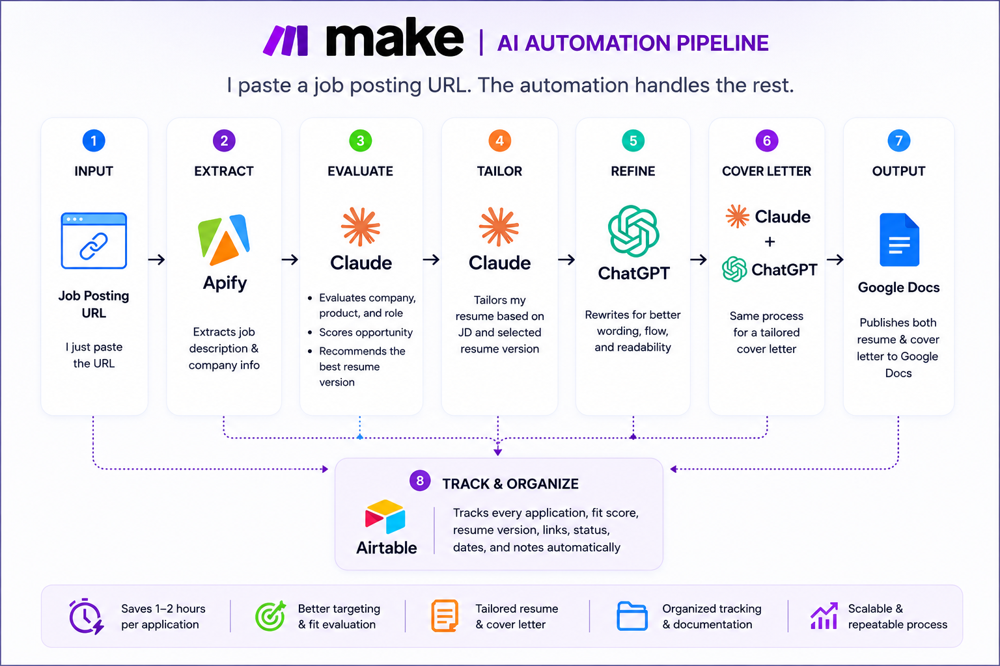

# AI Job Application Automation

End-to-end AI workflow that transforms a job posting URL into tailored application documents and tracked job applications.

Built while transitioning from 7+ years in Real Estate sales into SaaS Sales.

---

## Architecture

The workflow starts with a job posting URL and automatically extracts the job description, evaluates the opportunity, selects the most appropriate resume version, generates a tailored resume and cover letter, publishes both documents to Google Docs, and tracks every application in Airtable.

---

## Tech Stack
• Make
• Airtable
• Claude API
• OpenAI API
• Apify API
• Google Docs API
• HTTP modules
• JSON parsing

---

## Features
✓ One-click application workflow
✓ Job description extraction
✓ Company evaluation
✓ Resume scoring
✓ Resume version selection
✓ Resume tailoring
✓ Cover letter generation
✓ Google Docs generation
✓ Airtable tracking

---

## Why I Built It
Tailoring every application manually often took 1–2 hours.
Rather than improving prompts over and over, I wanted to automate the entire workflow while keeping the output personalized.
This became my first end-to-end AI automation project.
